# Nexlytix — Database Schema & Data Model

## Overview

Nexlytix uses **InfluxDB v2.7** — a time-series database. InfluxDB does **not** have traditional relational tables. Instead it uses:

| Concept | InfluxDB term | SQL equivalent |
|---|---|---|
| Database | **Bucket** (`telemetry`) | Database |
| Table | **Measurement** (`sensor_reading`) | Table |
| Indexed column | **Tag** | Indexed column |
| Value column | **Field** | Regular column |
| Row | **Record / Point** | Row |
| Primary key | **`_time` + Tags** | Composite PK |

---

## Measurement: `sensor_reading`

This is the **only** measurement (table) in the system. Every IoT device writes to it.

### Tags (indexed, string type)

| Tag | Type | Description | Constraints |
|---|---|---|---|
| `device_id` | string | Unique device identifier | Alphanumeric + `-_`, max 64 chars |

Tags are **indexed** and act like a "foreign key" pointing to a logical device entity.

### Fields (not indexed, typed)

| Field | Type | Unit | Valid Range | Description |
|---|---|---|---|---|
| `temp_c` | float | °C | -50 to 100 | Ambient temperature |
| `humidity_pct` | float | % | 0 to 100 | Relative humidity |
| `vibration_rms` | float | m/s² | 0 to 10 | RMS vibration magnitude |
| `seq` | integer | — | 1 to ∞ | Sequence number (replay protection) |
| `status` | string | — | `ok`, `warn`, `error` | Device self-reported status |

### Time Column (auto-managed)

| Column | Type | Description |
|---|---|---|
| `_time` | RFC3339 timestamp | Measurement timestamp (nanosecond precision, stored as UTC) |

---

## Data Flow Diagram

```mermaid
flowchart LR
    subgraph IoT["IoT Device (Edge)"]
        DEV["📟 Sensor Device\n(VemCore-01, etc.)"]
    end

    subgraph Ingestion["Nexlytix Backend"]
        MQTT["📡 MQTT Broker\n(Mosquitto :1883)\nTopic: nexlytix/+/+/telemetry"]
        SUB["🔄 MQTT Subscriber\n(subscriber.py)"]
        SEC["🔒 Security Layer\n• device_id validation\n• HMAC verification\n• Replay protection\n• Sensor range check"]
        WRITE["✍️  write()\n(write.py)"]
    end

    subgraph Storage["InfluxDB :8086"]
        BUCKET["🗄️  Bucket: telemetry\nMeasurement: sensor_reading"]
    end

    subgraph API["REST API\nFastAPI :8000"]
        QAPI["📥 GET /api/telemetry/{device_id}\n• API Key auth\n• Rate limit: 100/min"]
        QUERY["🔍 query()\n(query.py)\nFlux query, last 24h, limit 10"]
    end

    subgraph Client["Client"]
        UI["🖥️  Frontend / Dashboard\nor Postman"]
    end

    DEV -- "JSON payload\n(MQTT publish)" --> MQTT
    MQTT --> SUB
    SUB --> SEC
    SEC -- "valid data" --> WRITE
    WRITE -- "InfluxDB Point" --> BUCKET
    BUCKET -- "Flux query" --> QUERY
    QUERY --> QAPI
    QAPI -- "JSON response" --> UI
    UI -- "GET + X-API-Key" --> QAPI
```



---

## "Relationships" in InfluxDB

InfluxDB is **schema-less and non-relational**. Relationships are modelled differently:

```mermaid
erDiagram
    DEVICE {
        string device_id PK "e.g. VemCore-01 (logical, not stored)"
        string location   "metadata (not in InfluxDB)"
        string type       "metadata (not in InfluxDB)"
    }

    SENSOR_READING {
        timestamp _time     PK "auto-managed"
        string    device_id FK "TAG — indexes this field"
        float     temp_c
        float     humidity_pct
        float     vibration_rms
        int       seq
        string    status
    }

    DEVICE ||--o{ SENSOR_READING : "has many (via device_id tag)"
```



> **Note:** The `DEVICE` entity is **logical** — Nexlytix does not store a device registry. The `device_id` tag in `sensor_reading` is the only reference. If you add a device registry in the future (e.g. PostgreSQL), `device_id` would be your foreign key.

---

## Fake Devices (Seeded)

| device_id | Description |
|---|---|
| `VemCore-01` | Primary VEM core sensor unit |
| `VemCore-02` | Secondary VEM core sensor unit |
| `SiteB-Gateway` | Remote site gateway device |
| `FactoryFloor-03` | Factory floor environment sensor |
| `Warehouse-Alpha` | Warehouse monitoring unit |

---

## Flux Query (used by `query.py`)

```flux
from(bucket: "telemetry")
  |> range(start: -24h)
  |> filter(fn: (r) => r["device_id"] == "VemCore-01")
  |> pivot(rowKey:["_time"], columnKey: ["_field"], valueColumn: "_value")
  |> sort(columns: ["_time"], desc: true)
  |> limit(n: 10)
```

**Explanation:**
- `range(start: -24h)` — only last 24 hours of data
- `filter` — narrow to one device using the `device_id` **tag**
- `pivot` — converts field rows into columns (like a SQL row)
- `sort` — newest first
- `limit(n: 10)` — max 10 records

---

## MQTT Topic Structure

```
nexlytix / {org} / {device_id} / telemetry
    ▲          ▲         ▲           ▲
    │          │         │           └─ fixed suffix
    │          │         └─ maps to device_id tag in InfluxDB
    │          └─ org name (e.g. "nexlytix")
    └─ project namespace
```

Wildcard subscription: `nexlytix/+/+/telemetry` (matches all orgs and all devices)
